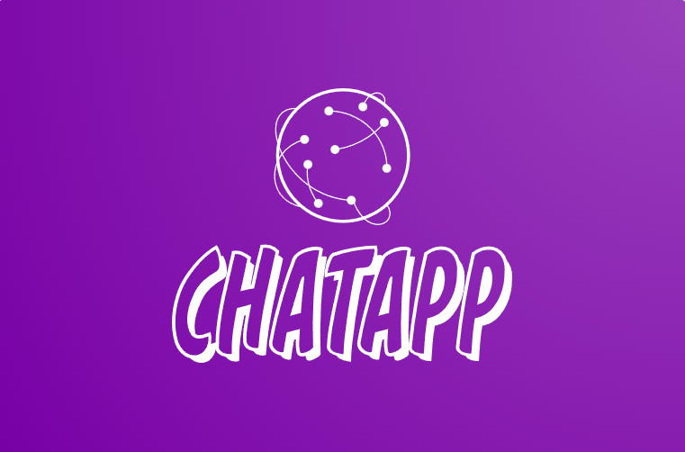
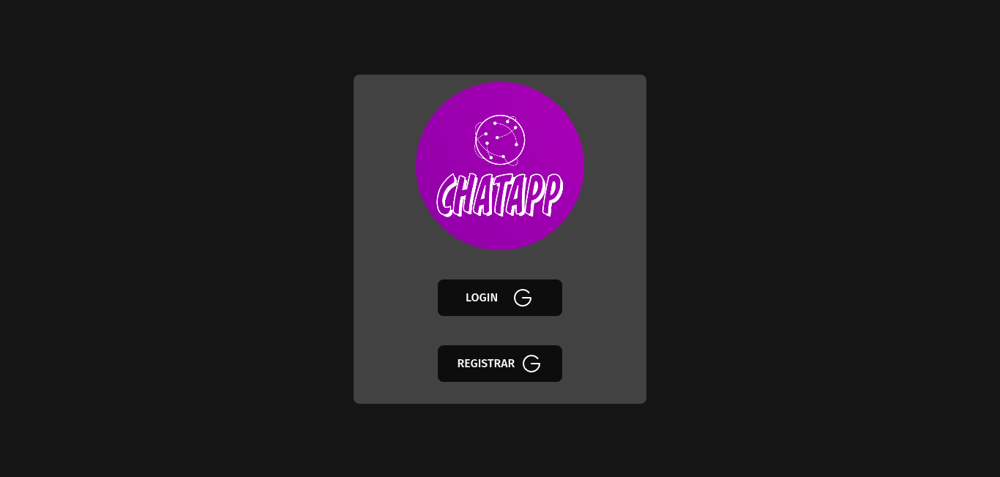
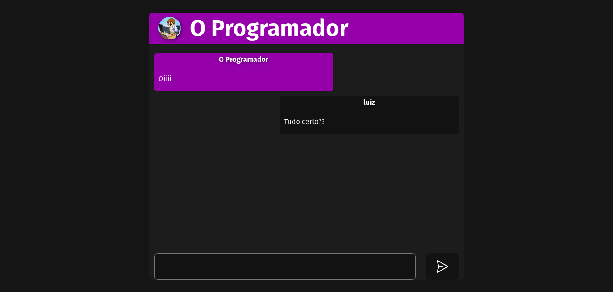
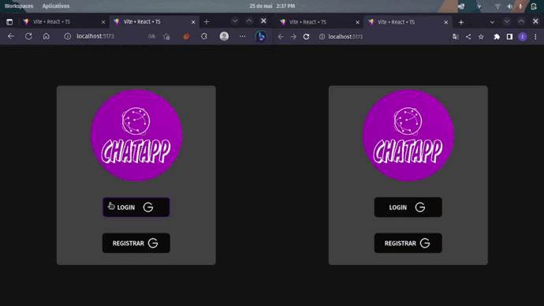

# CHAT APP

## SOBRE O PROJETO 

O projeto ChatApp é fácil de compreender: trata-se de um chat para a troca de mensagens entre usuários. No entanto, o interessante desta aplicação é a maneira como ela foi desenvolvida. Neste momento, vamos focar em seu funcionamento antes de entrar em detalhes sobre a implementação.

### FUNCIONAMENTO DA APLICAÇÃO

- Criação de usuários com conta do Google:
    - A aplicação exige que uma conta do Google seja utilizada para registrar o usuário.

- Login com conta do Google:
    - A aplicação requer um login utilizando a conta do Google utilizada para criar o usuário.

- Troca de mensagens de texto entre usuários:
    - Após o login, os usuários podem trocar mensagens de texto com todos os usuários cadastrados.

### DESAFIOS

Desde o início, quando tive a ideia de desenvolver esta aplicação, estava pensando em uma forma de utilizar um message broker e logo pensei em um chat para a troca de mensagens, onde todos os usuários pudessem ver e enviar mensagens. Em seguida, percebi que poderia usar algum sistema de autenticação para aprimorar e tornar a aplicação mais profissional. Além de tudo isso, escolhi utilizar a API do Google para implementar toda a parte de autenticação.

Inicialmente, acreditei que seria algo trivial de ser criado, pois já havia utilizado a API do Google em outras ocasiões e já havia integrado bancos de dados MySQL em diversas aplicações. Porém, o uso de um message broker foi completamente novo para mim, e tive que compreender o padrão [**publish/subscribe**](https://www.rabbitmq.com/tutorials/tutorial-three-javascript.html) fornecido pela documentação do RabbitMQ. Confesso que me confundi várias vezes em relação ao seu funcionamento, mas felizmente consegui superar esse desafio.

### PADRÃO PUBLISH/SUBSCRIBE

Vou tentar explicar o padrão de forma simples. O **RabbitMQ** utiliza alguns padrões para definir quem envia e quem recebe as mensagens. Nesse sentido, quem envia a mensagem é chamado de **Produtor** (Producer) e quem recebe a mensagem é chamado de **Consumidor** (Consumer). De maneira resumida, esse padrão envia qualquer mensagem criada pelo **Produtor** para todos os **Consumidores** conectados ao **Produtor**.

### TECNOLOGIAS UTILIZADAS

- Express.js
- RabbitMQ
- Socket.IO
- JSON Web Token
- Google OAuth2
- Prisma
- MySQL

### TÉCNICAS DE DESENVOLVIMENTO

- Arquitetura limpa
- Testes unitários
- Padrões de projeto utilizados:
    - Factory
    - Repository
    - Dependency Injection

### SCREENSHOTS DA APLICAÇÃO

- LOGIN E REGISTRO DE USUÁRIO UTILIZANDO O GOOGLE
 </img>

- TELA DE CHAT EM TEMPO REAL
 </img>

- APLICAÇÃO FUNCIONANDO
 </img>

## VEJA A APLICAÇÃO VOCE MESMO

- A hospedagem foi realizada usando uma instância do Lightsail da AWS.

- O RabbitMQ está instalado na mesma máquina que a aplicação, o que não é uma boa prática quando se trata de aplicações que visam escalabilidade. No entanto, isso é apenas uma demonstração e não temos como objetivo a escalabilidade.

- O banco de dados está hospedado no serviço https://planetscale.com/.

- O domínio foi comprado no site https://www.hostinger.com/.

- O repositório do frontend, lembrando que o foco do projeto não é o frontend https://github.com/luizrgf2/chatFrontend

 - Você pode testar a aplicação aqui <a href="https://chat-app.online/">TESTE AGORA</a>